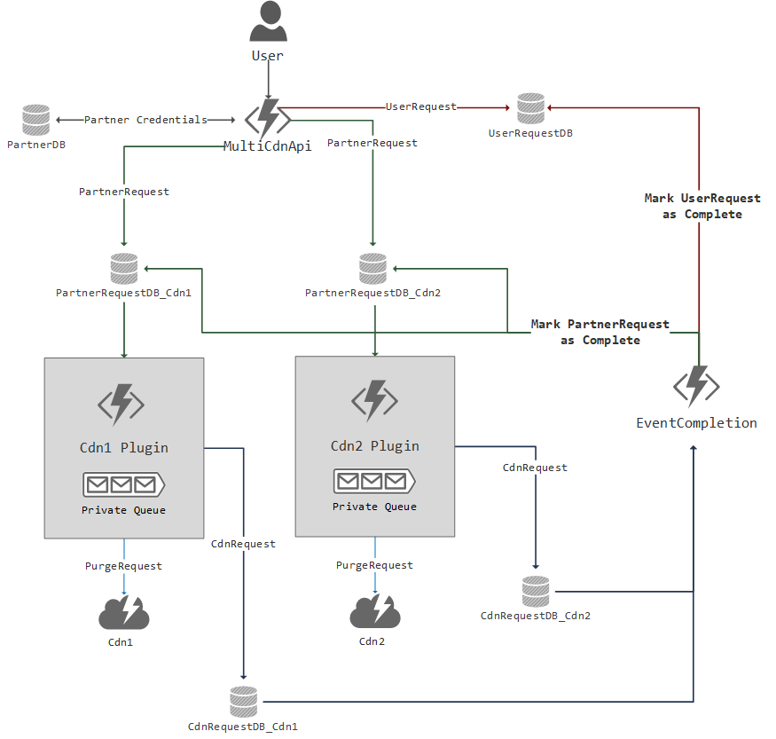

# CachePurge: Cache Invalidation and Purge for multiple CDNs
CachePurge is a centralized service that allows the user to invalidate and purge cache from multiple CDNs easily.

## Introduction
CacheOut is implemented in C# using the dotnet core framework and uses a combination of [Azure Functions](https://docs.microsoft.com/en-us/azure/azure-functions/), [CosmosDB](https://docs.microsoft.com/en-us/azure/cosmos-db/) and [Azure Queues](https://docs.microsoft.com/en-us/azure/storage/queues/storage-queues-introduction) to create a workflow that begins upon receiving a purge request from the user. 

The design is as follows:

# Getting Started
#### Local Setup
  - Refer to this doc for prerequisites: [Code and Test Azure functions locally](https://docs.microsoft.com/en-us/azure/azure-functions/functions-develop-local)
  - Clone this repo to your local drive
  - Once your local environment is setup, edit [EnvironmentConfig.cs](CdnLibrary/src/Utils/EnvironmentConfig.cs) with your config values

#### Making changes
The project structure is divided into the following:

  1) **CachePurgeLibrary**: 
     - non-CDN specific code that is utilized throughout the solution
     - no changes needed if you're not making significant structural changes to the project 
     
  2) **CdnLibrary**: 
     - CDN library code used in CdnPlugins and MultiCdnApi
     - will need to edit this project heavily to add your own custom CDN specific processing logic
     
  3) **CdnPlugins**:
     - contains CdnPlugin functions and EventCompletion function
     - change as needed based on CDNs used
     
  4) **MultiCdnApi**:
     - contains user facing API
     - change as needed based on CDNs and user input

To make changes to the CDNs for e.g. to add or remove a CDN, you will need to add your custom CDN logic to [CdnLibrary](CdnLibrary/src/CdnLibrary.csproj). Propagate the changes down to [CdnPlugins](CdnPlugins/src/CdnPlugins.csproj) and [MultiCdnApi](MultiCdnApi/src/MultiCdnApi.csproj).
